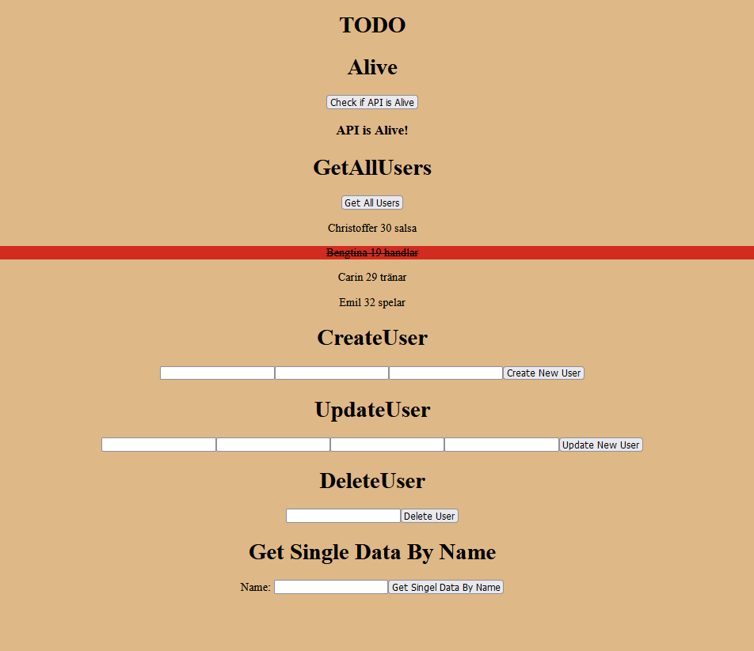
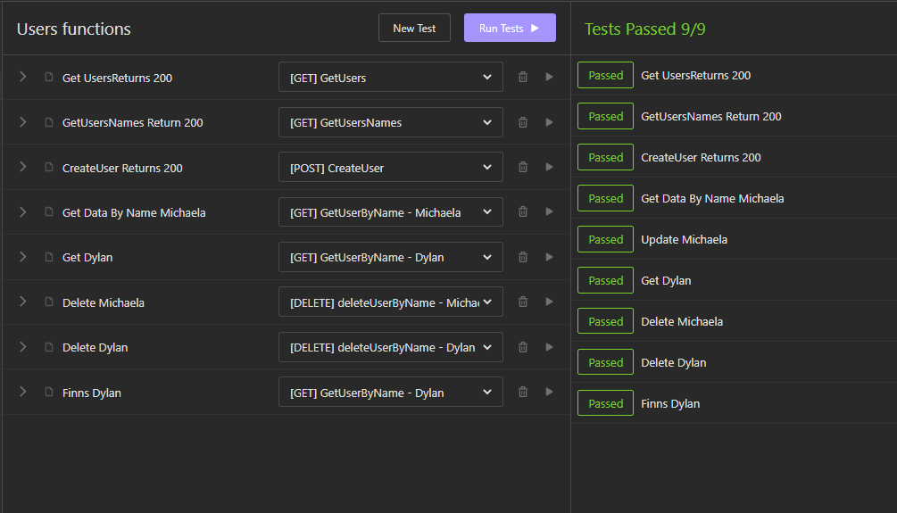

inlämning

<h1>Webbserverprogrammering</h1>

<h2>Projektbeskrivning av Webbserverprogrammering</h2>

Min inlämning till denna kurs som är en Todo Lista och är byggt av backend och frontend. Jobbet i den här kursen handlar om olika att frontend och backend ska prata med varandra via API. Vi har även gjort tester i insomnia. 

<h4>Planeringen på Trello</h4>
Jag använder mig bara av Trello när det kommer till planeringar.

[Trello planering](https://trello.com/b/7JvHnykX/webbserverprogrammering)

 Todo

 Insomna tester

<h3>Beskriv lite olika lösningar du gjort</h3>
Först gav jag mig ut på en A betyg och började med att bara få ut bara namnen i en input och tänkte att jag sedan kommer bygga på den input med allt funktion. Det tog inte lång tid att förstå att jag inte var där riktigt. Det var en anledning för att satsa på ett mindre projekt som inte är A nivå. 

<h3>Beskriv något som var besvärligt att få till:</h3>
Det som var svår var att översätta från JS till React, det fick mig att göra om projektet 5 gånger. Sedan fick jag göra allt från början med react och det fick jag göra 4 gånger. Det svåraste i projektet var dropdown och useContext.

<h3>Beskriv om du fått byta lösning och varför i sådana fall:</h3>
Jag gav mig ut på Postman och försökte använda den för att få med mig något nytt. Men det ångrade jag ganska snabbt.

<h3>Beskriv hur du felsökt ditt program när det uppstått problem:</h3>
Insomna har varit det stora hjälpen efter WebStorms själva terminal. Dessa 2 har varit mitt sätt att felsöka när det kommer till backend och även manuella tester har jag använt på WebStorms Terminal.

<h3>Vad gick bra:</h3>
Det som gick väldigt bra var att testerna på insomna och hur känslig backend är om man jämför med frontend.

<h3>Vad gick dåligt:</h3>
Det som gick dåligt var att kopplingen mellan backend och frontend. Jag hade svårt och förstå varför API Alive kommer med i min frontend men inte mina TodoList. Det tog längre tid att förstå den. Jag är fortfarande osäker på den men med hjälp av mina klasskamrater Michaela och Christoffer har jag en aning om hur den fungerar.

<h3>Vad har du lärt dig:</h3>
Jag har lärt mig att bygga en Api som svarar i frontend. Jag har lärt mig insomnia tester.

<h3>Vilka möjligheter ser du med de kunskaper du fått under kursen.</h3>
Jag har fått möjligheter att förstå vad en backend och frontend gör och hur de kopplas ihop även om jag föredrar frontend så har jag med mig en grund kunskap av backend.

<h3>Motivera varför du valt en specifik lösning:</h3>
Jag valde att inte jobba mycket med CSS och frontend. Min största focus var på API Alive. Och det är en anledning varför jag har kvar den på min frontend och den är nyttigt för att veta om backend är startad 

<h3>Lämna förslag på förbättringar av din kod:</h3>
Jag hade velat jobba lite mer och få allt att fungera i en box istället att ha de olika delar så som jag har nu. Men jag har tyvärr inte den kunskapen till A nivån denna gången.

<h3>Lämna exempel på lösningar du valde att inte implementera:</h3>
Jag valde de bästa lösningar jag kunde få, men hade jag valt att satsa på A kanske hade jag kunnat lägga allt i två eller 3 input med bättre CSS och finare layout.

<h3>Lämna förslag på förbättringar av din UI/UX design eller reflektera över den.</h3>
Jag hade lätt kunnat göra en bättre layout än vad jag har nu. Den jag har nu är bara för att få projektet att fungera och förstå min projekt bättre.