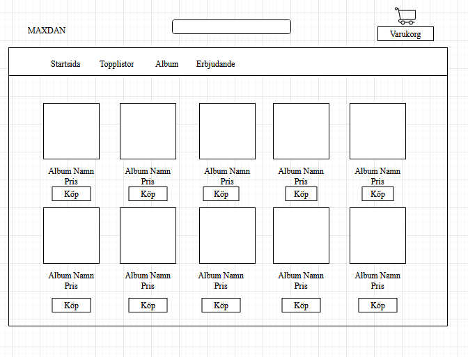

<h1>Webbutveckling 2</h1>

<h2>WebbShop med React</h2>

[Trello planering](https://trello.com/b/ESYWAJhl/webbutveckling-2)

<h3>Beskriv lite olika lösningar du gjort.</h3>
Jag hade 4 st länkar och en av de är album sidan och resten var bara för att visa att routing och navigeringen fungerar som det ska.

<h3>Beskriv något som var besvärligt att få till.</h3>
Det som var svår var att översätta från JS till React, det fick mig arr göra om projektet 5 gånger och ändå lyckades inte sedan fick jag göra det på react direkt det tog mig 4 gånger även där fick jag hjälp av mina klasskamrater (Michaela, Christoffer och Ursula) Allt i det här projektet var svårt men det svåraste var useContext, och useState.

<h3>Beskriv om du fått byta lösning och varför i sådana fall.</h3>
Jag bytte min CSS till css.module. CSS är inte lika strikt som css.module. Det hjälpte mig att kunna justera allt som jag ville utan att det påverkade andra filer.

<h3>Beskriv hur du felsökt ditt program när det uppstått problem</h3>
Jag har alltid console.log uppe på den andra skärmen och i React så ser man nästan alltid vart man gjort fel. Jag använder mycket inspektor och nu har vi fått möjlighet till att ta tester i kodningen.

<h3>Vad gick bra</h3>
Import mellan apparna gick väldigt bra. Css.module gick jätte bra. Jag använde ColorZilla och det funkade bra. Jag lyckades med allt jag ville ha med.

<h3>Vad gick dåligt</h3>
Dropdown, UseState och useContext/provider. Jag hade väldigt svårt att få ihop allt i en säck, men det löste sig med hjälp av grupparbeten och att jag förstår hur de kopplar ihop.

<h3>Vad har du lärt dig</h3>
Jag har lärt mig att använda navigering och det behöver man en routing för.
Tester är något jag har sett fram emot och det är en viktig del i arbetet tycker jag. Jag har lärt mig lite gran men inte tillräckligt kan jag tycka.
Det var mycket nytt i denna kursen och props var en av de. Det är en koppling mellan olika komponenter.

<h3>Vilka möjligheter ser du med de kunskaper du fått under kursen.</h3>
Med tanke på så stora företag som använder React så tror att det kan vara en bra framtid om man lägger lite mer tid på att lära sig. Man behöver många övningar innan man kan prata React. Grunden har jag fått lära mig nu underkursen. Det hade varit bra om kurden var längre och man gick in på det lite djupare.

<h3>Motivera varför du valt en specifik lösning.</h3>
Jag valde en simpel hemsida bara för att få känna på React hur mycket jag får av React.

<h3>Lämna förslag på förbättringar av din kod.</h3>
Jag ha nog lite för många mappar som inte behövs riktigt.

<h3>Lämna exempel på lösningar du valde att inte implementera</h3>
Jag ville ge mig på styling i JS filar och inte i CSS. Men det var för lite kunskap för att upp nå målet

<h3>Lämna förslag på förbättringar av din UI/UX design eller reflektera över den.</h3>
Jag tycker om ljusa färger och locka ögonen och inte trötta ut ögonen efter en lång tid.

